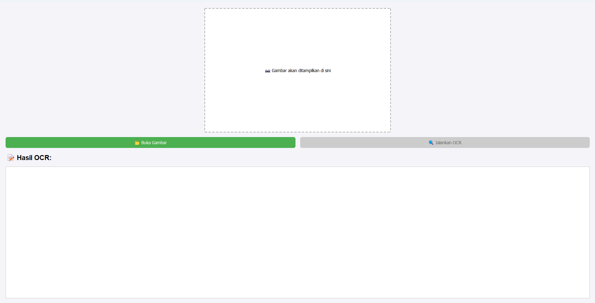
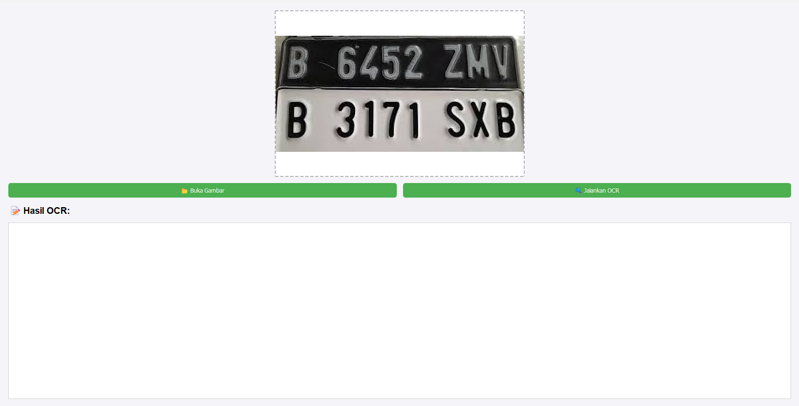
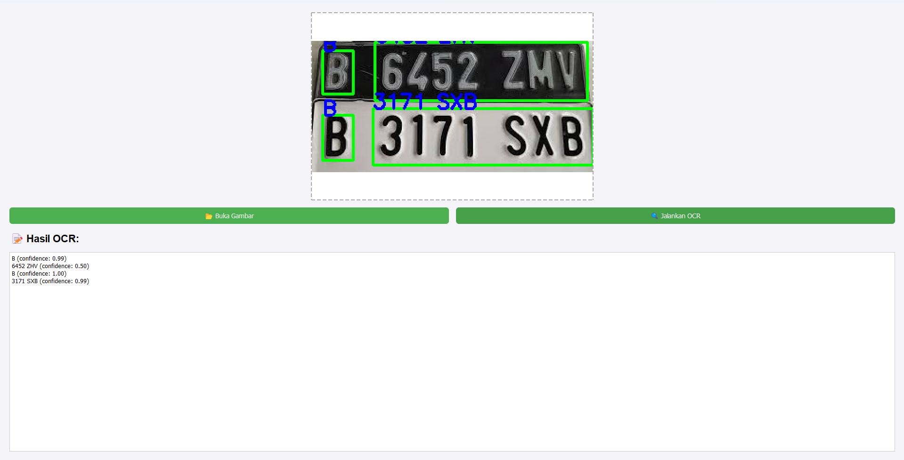

# Belajar_OCR-EasyOCR

Proyek ini merupakan aplikasi GUI sederhana untuk melakukan OCR (Optical Character Recognition) menggunakan:

- **Python**
- **PyQt5** (untuk tampilan antarmuka pengguna)
- **EasyOCR** (engine untuk mengenali teks dari gambar)
- **OpenCV** (untuk membaca dan menampilkan gambar)
- **NumPy** (untuk manipulasi array gambar)

---

##  Yang Telah Dipelajari

1. **Dasar OCR (Optical Character Recognition)**
   - Menggunakan library/Model `Easyocr` untuk membaca teks dari gambar.
   - Mengetahui bahwa EasyOCR dapat membaca banyak bahasa, termasuk `en` (Inggris) dan `id` (Indonesia).

2. **Membuat GUI dengan PyQt5**
   - Menampilkan gambar menggunakan `QLabel`.
   - Menampilkan teks hasil OCR di `QTextEdit`.
   - Menambahkan tombol untuk membuka gambar (`Buka Gambar`) dan menjalankan OCR (`Jalankan OCR`).
   - Mengatur tampilan tombol dengan style custom dan menonaktifkan tombol OCR sampai gambar dipilih.

3. **Proses Gambar dan Konversi**
   - Menggunakan `cv2.imread()` dan `cv2.cvtColor()` untuk membaca dan mengubah format warna gambar ke RGB.
   - Mengubah gambar OpenCV menjadi format `QImage` agar dapat ditampilkan di PyQt5.

4. **Menampilkan Hasil OCR di Gambar**
   - Menggambar bounding box pada teks yang terdeteksi menggunakan `cv2.rectangle()`.
   - Menambahkan teks langsung di gambar dengan `cv2.putText()`.
   - Menampilkan confidence (tingkat kepercayaan) untuk setiap teks yang terdeteksi.

5. **Pengaturan Library dan Lingkungan**
   - Mengatasi error duplikasi library Intel MKL dengan menambahkan:
      `os.environ["KMP_DUPLICATE_LIB_OK"] = "TRUE"`

---

## 💡 Fitur Aplikasi

-  Membuka gambar (PNG, JPG, JPEG, BMP)
-  Menampilkan gambar di GUI
-  Menjalankan OCR menggunakan EasyOCR
-  Menampilkan teks hasil OCR beserta tingkat confidence
-  Menampilkan bounding box dan teks langsung pada gambar

---

##  Screenshot Aplikasi

###  UI Awal

###  Setelah Membuka Gambar

###  Hasil Setelah OCR

---

##  Struktur Folder

OCR-EasyOCR-GUI/
├── ocr_easyocr_gui.py # File utama aplikasi GUI

├── README.md # Dokumentasi proyek

├── screenshots/ # Screenshot tampilan aplikasi

│ ├── ui_awal.png

│ ├── setelah_open_image.png

│ └── hasil_ocr.png

├── contoh-gambar/ # File gambar untuk uji OCR

│ └── sample_text.jpg

---

##  Cara Menjalankan

1. **Install library yang dibutuhkan:**
    pip install pyqt5 opencv-python numpy easyocr
   
2. **Jalankan aplikasi:**
    python ocr_easyocr_gui.py

**Tips Penggunaan**
- Gunakan gambar dengan teks yang jelas dan tidak blur untuk hasil terbaik.
- EasyOCR mendukung banyak bahasa; bahasa default dalam program ini adalah `en` dan `id`.

**Dibuat Oleh**

**Nama**: Ahmad Alfarizi

**Tanggal**: 24 September 2025

**Proyek**: Belajar OCR GUI dengan Python + PyQt5 + EasyOCR
